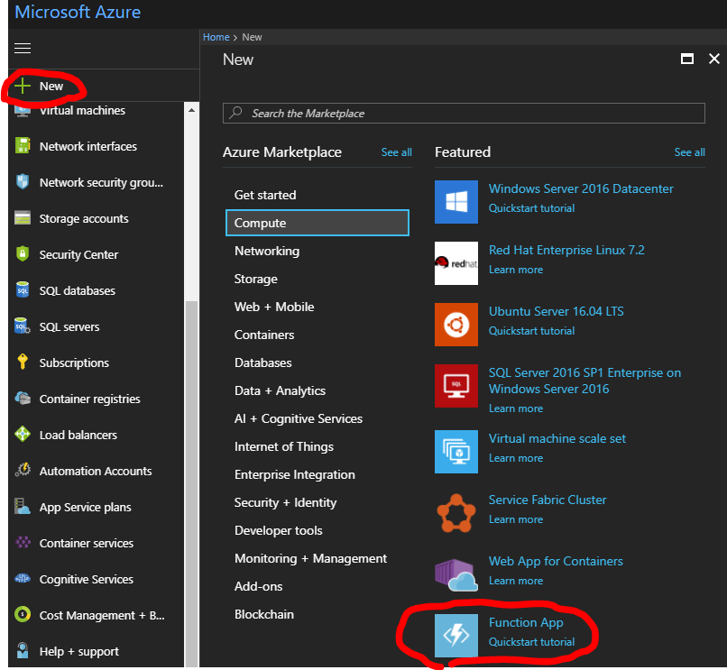
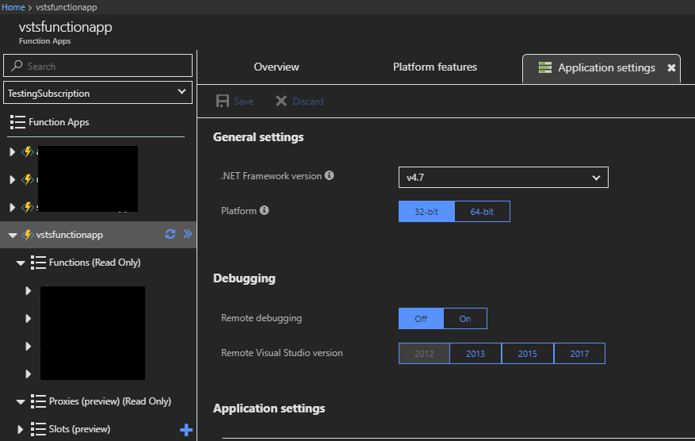
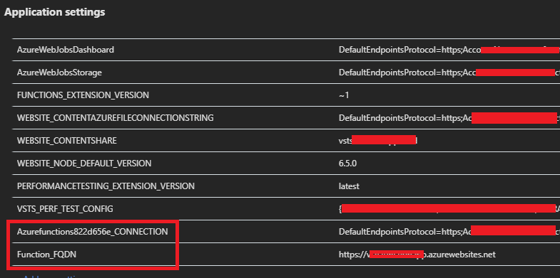
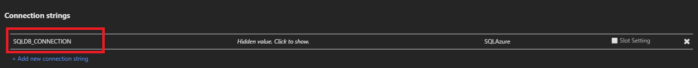
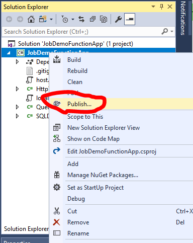
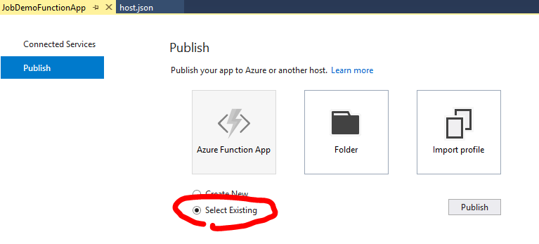
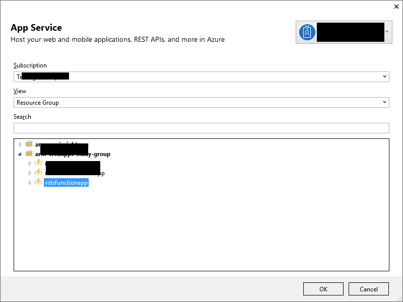
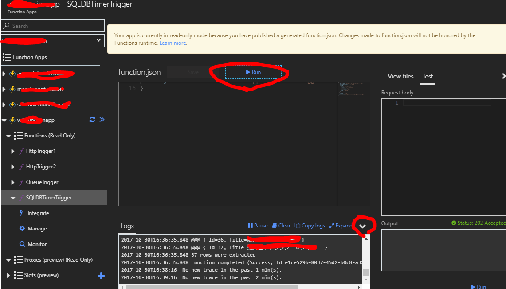

# AzureFunctions-CSharp-Sample
This application offers same samples using Azure Functions. 
- How to use QueueTriggers
- How to call nested Azure Functions applicatins ex. from QueueTriggers to HttpTriggers
- How to access SQL DB in Azure Functions
- How to access Azure Storage accounts in Azure Functions

## Requirement
Please setup "Azure Functions Tools for Visual Studio 2017" in your local machine.
- Azure Functions Tools for Visual Studio https://docs.microsoft.com/en-us/azure/azure-functions/functions-develop-vs
- Code and test Azure Functions locally https://docs.microsoft.com/en-us/azure/azure-functions/functions-run-local

## How to run this applications in your local machine
After pulling this application in your local machine. Edit "AzureFunctions-CSharp-Sample.git\JobDemoFunctionApp\JobDemoFunctionApp\local.settings.json".

````

{
  "IsEncrypted": false,
  "Values": {
    "AzureWebJobsStorage": "[YOUR_STORAGE_CONNECTION_STRING]",
    "AzureWebJobsDashboard": "",
    "Azurefunctions822d656e_CONNECTION": "[YOUR_STORAGE_CONNECTION_STRING]",
    "Function_FQDN": "[YOUR_AZURE_FUNCTIONS_FQDN such likehttp://localhost:7071]"
  },
  "ConnectionStrings": {
    "SQLDB_CONNECTION": "[YOUR_SQL_DB_CONNECTION_STRING]"
  }
}

````

And create a SQL table in your SQL Database using "AzureFunctions-CSharp-Sample.git\AzureFunctions-Sample-DDL.sql".

Now, you can run this application in your local machine. You can debug your application using Visual Studio offering features.


## How to run this applications in Azure environment
At first, create Azure Function in Azure portal like below.


Setup your Azure Functions in Azure portal. Choose "Application settings".



Setup "Application settings" section in "Application settings" tab. Setup "Azurefunctions822d656e_CONNECTION" and "Function_FQDN" variables in the tab.



Setup "Connection strings" section in "Application settings" tab. Setup "SQLDB_CONNECTION" variables in the tab.



Publish this application with Visual Studio following below images.





And create a SQL table in your SQL Database using "AzureFunctions-CSharp-Sample.git\AzureFunctions-Sample-DDL.sql" if it still doesn't exist.

For confirming this applicaion behavior, please refer below.
- Put queue messages into your "myqueue-items" queue of your Azure Storage. 
- Access "SQLDBTimerTrigger" function in your Azure Functions, and press "Run" button. You can watch logs in bottom. Please read "SQLDBTimerTrigger.cs" for detail.




## Trouble shooting
- Note your firewall and gateway when you run this applicaiton in your local machine

 
